# Spotter

Spotter is a **Compose Multiplatform (CMP)** mobile app for Android and iOS. It helps you find nearby charging stations, car washes, parking, fuel, and repair shops. Most of the UI and business logic is shared. Platform code is used only where it is really needed (maps, location, system bars).

## Features

- Search and category filters (charging, car wash, parking, fuel, repair)
- List and column layout
- Map with route preview and turn-by-turn navigation
- Favorites and recent search
- Turkish and English, light and dark theme
- OpenStreetMap data through the Overpass API

## Screenshots

### iOS

<p align="center">
  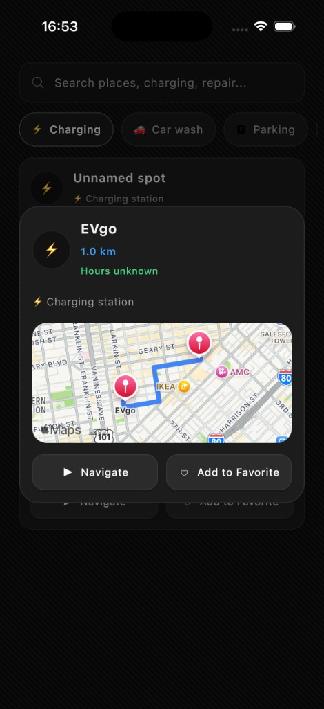
  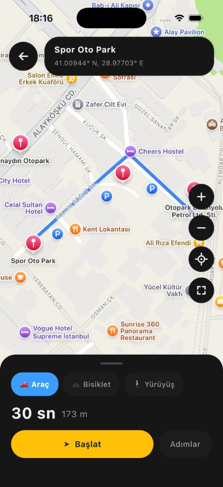
  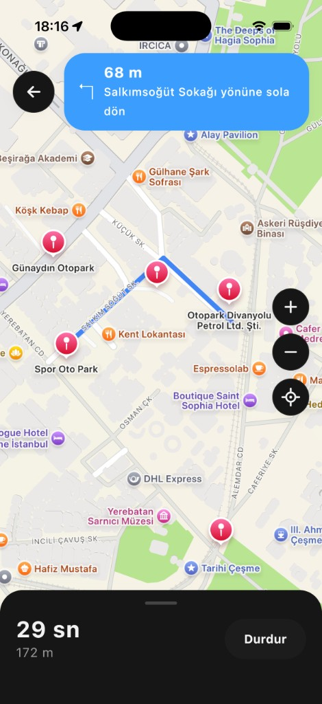
</p>
<p align="center">
  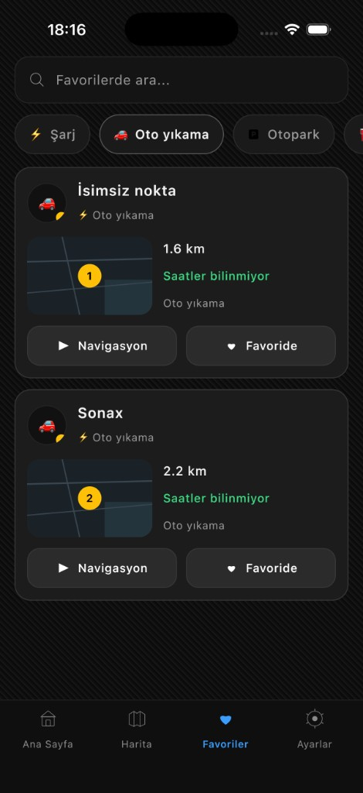
  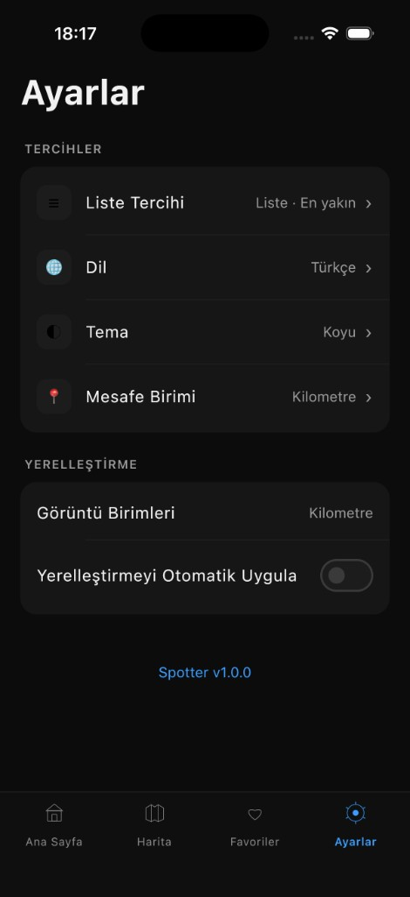
  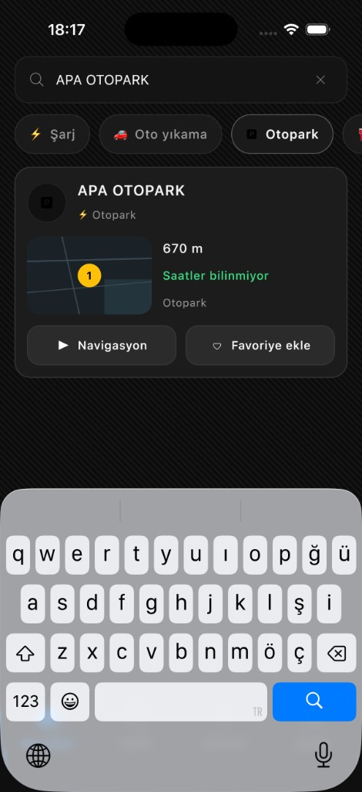
</p>
<p align="center"><sub>Home · Map · Navigation · Favorites · Settings · Search</sub></p>

### Android

<p align="center">
  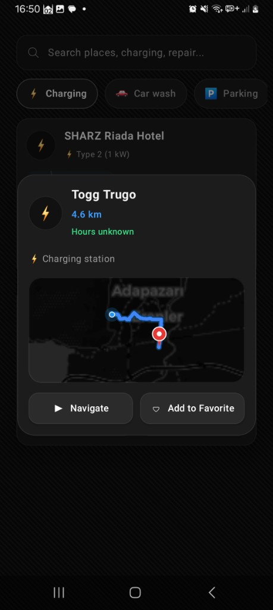
  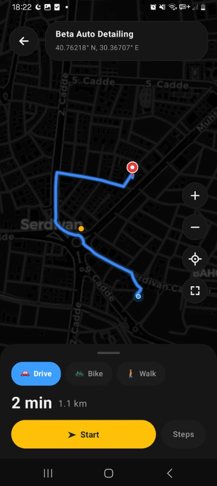
  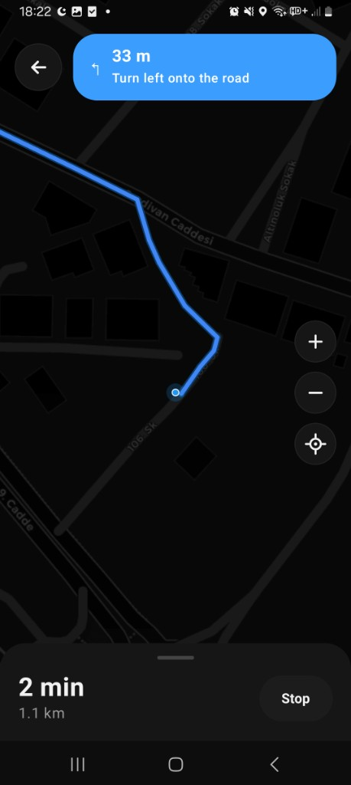
</p>
<p align="center">
  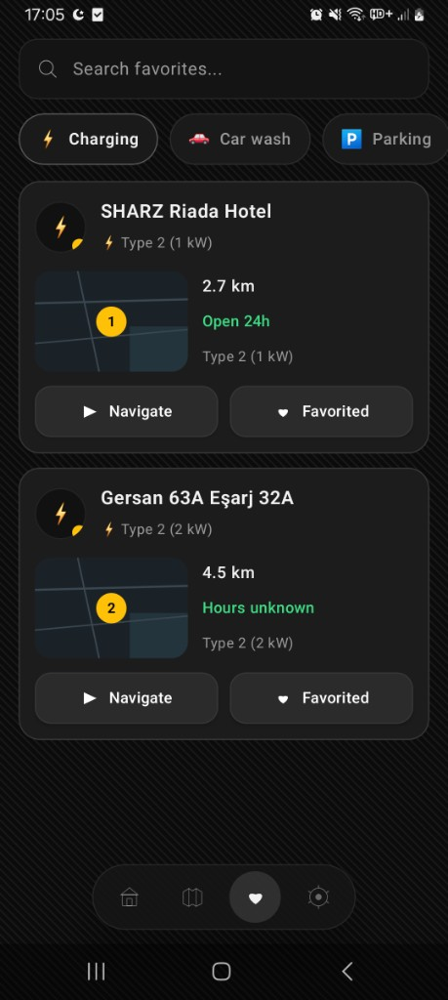
  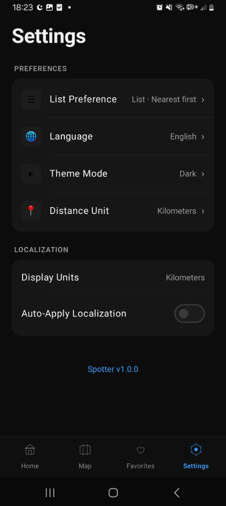
  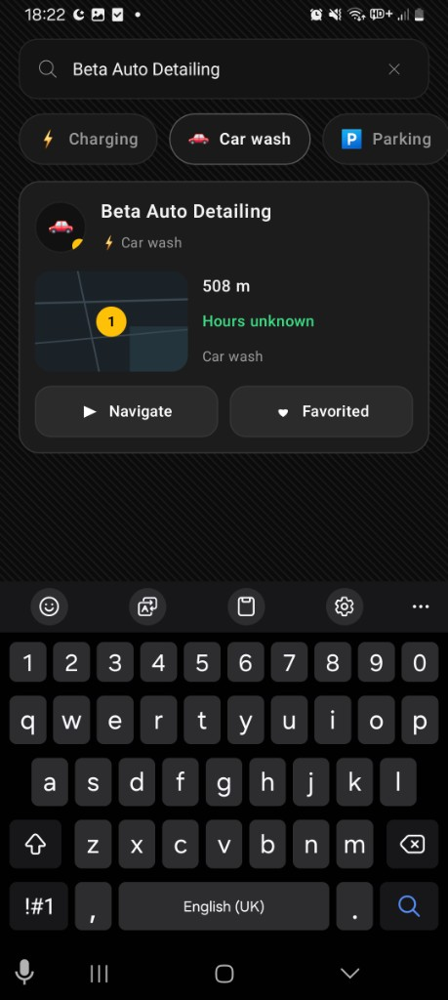
</p>
<p align="center"><sub>Home · Map · Navigation · Favorites · Settings · Search</sub></p>

## Architecture

The app follows a **layered, feature-based** design:

```
UI (Compose)  →  ViewModel  →  Use Case  →  Repository  →  API / Local storage
```

**Main ideas:**

- **Unidirectional data flow** — ViewModels expose state; the UI sends user actions back.
- **Feature modules** — Each screen area (home, map, favorites, …) is split into small Gradle modules.
- **Dependency rule** — `presentation` depends on `domain`. `data` implements interfaces from `domain`. `domain` does not know about UI or Android/iOS APIs.
- **Shared first** — Common code lives in `commonMain`. Platform code is in `androidMain` / `iosMain` only when required.

## Modular Structure

Every feature is split into up to four modules:

| Module | Role |
|--------|------|
| **contract** | Navigation routes, typed destinations, serializers |
| **domain** | Models, repository interfaces, use cases |
| **data** | API clients, repository implementations, cache |
| **presentation** | Compose screens, ViewModels, strings |

**Core modules** (shared by all features):

| Module | Role |
|--------|------|
| `core:model` | Shared data models |
| `core:domain` | Common result types (`RestResult`, …) |
| `core:data` | Base repository, HTTP helpers, retry logic |
| `core:network` | Ktor client, Overpass config |
| `core:database` | Room database (SQLite) |
| `core:datastore` | User settings (theme, language, list mode) |
| `core:navigation` | Navigation manager, tab switching |
| `core:spot-ui` | Reusable UI (cards, search bar, bottom bar) |
| `core:presentation` | Base ViewModel |

**Feature modules:** `home`, `map`, `favorites`, `settings`, `splash`, `detail`

**App shell:**

| Module | Role |
|--------|------|
| `app:shared` | `SpotterApp()`, Koin setup, nav graph |
| `app:ui-components` | Design system, theme, colors |
| `composeApp` | Android application entry |
| `iosApp` | iOS application entry (Xcode + CMP framework) |

## Platform-Specific Code

Most screens are 100% shared Compose. These parts are different on each platform:

### Android (local)

| Area | Technology |
|------|------------|
| App entry | `MainActivity` → `SpotterApp()` |
| Map | **OSMDroid** (`MapView`, markers, polylines) |
| Location | **Google Play Services** (Fused Location Provider) |
| Geocoding | Android `Geocoder` |
| HTTP engine | Ktor **OkHttp** |
| Database | Room with Android `Context` |
| Settings storage | Multiplatform Settings (SharedPreferences) |
| System UI | Edge-to-edge, WindowInsets padding |
| Permissions | Activity Result API for location |

### iOS (local)

| Area | Technology |
|------|------------|
| App entry | Xcode project → Kotlin framework → `SpotterApp()` |
| Map | **MapKit** (`MKMapView` via `UIKitView`) |
| Location | Core Location (platform provider; fallback coordinates when unavailable) |
| HTTP engine | Ktor **Darwin** |
| Database | Room with iOS file path |
| Settings storage | Multiplatform Settings (UserDefaults) |
| System UI | Custom status / navigation bar padding |

### Shared (both platforms)

| Area | Technology |
|------|------------|
| UI | Compose Multiplatform, Material 3 |
| Navigation | Navigation 3, type-safe routes |
| DI | Koin |
| Async | Kotlin Coroutines, Flow |
| Spots data | **Overpass API** (OpenStreetMap) |
| Routing | **OSRM** (`router.project-osrm.org`) |
| Images | Coil 3 |
| Serialization | kotlinx.serialization |

## Tech Stack

| Layer | Tools |
|-------|-------|
| Language | Kotlin 2.4 |
| UI | Compose Multiplatform 1.11, Material 3 |
| Architecture | Feature modules, MVVM, Use Cases |
| DI | Koin 4 |
| Network | Ktor 3 |
| Local DB | Room 3 (SQLite) |
| Settings | Multiplatform Settings |
| Maps | OSMDroid (Android), MapKit (iOS) |
| Location | Play Services (Android), Core Location (iOS) |
| Build | Gradle, KSP, custom convention plugins |

## Project Layout

```
Spotter/
├── composeApp/              # Android app module
├── iosApp/                  # iOS app + Kotlin framework
├── app/
│   ├── shared/              # SpotterApp, Koin, navigation wiring
│   └── ui-components/       # Theme, colors, design system
├── core/
│   ├── model, domain, data, network, database, datastore
│   ├── navigation, presentation, spot-ui
├── feature/
│   ├── home/       (contract · domain · data · presentation)
│   ├── map/        (contract · domain · data · presentation)
│   ├── favorites/  (contract · domain · data · presentation)
│   ├── settings/   (contract · presentation)
│   ├── splash/     (contract · presentation)
│   └── detail/     (contract · domain · data · presentation)
├── docs/screenshots/        # README images
└── build-logic/             # Gradle convention plugins
```

## Getting Started

**Requirements**

- JDK 17+
- Android Studio (for Android)
- Xcode 16+ (for iOS)
- Kotlin 2.4+

**Android**

```bash
./gradlew :composeApp:assembleDebug
```

Run from Android Studio with the `composeApp` configuration.

**iOS**

```bash
open iosApp/iosApp.xcodeproj
```

Select a simulator or device in Xcode and press Run. Gradle builds the shared Kotlin framework first.
